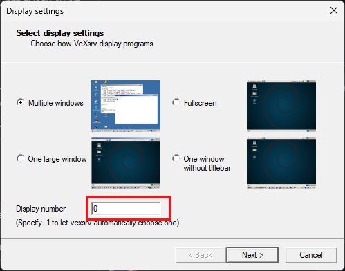

### If using git, change the input file dealt by github to crlf since window is DOS while linux is unix:
``` bash
git config --global core.autocrlf input
```

## Steps onto setting up the simulation
**Step 1**: [Download and install docker on window](https://docs.docker.com/desktop/setup/install/windows-install/) <br>
**Step 2**: Install WSL2 by using following command in Command Line:
```bash
wsl --install
```
**Step 3**: Clone the github repo. Make sure to change git config as mentioned above.<br>
**Step 4**: [Download VcXsrv for Window](https://sourceforge.net/projects/vcxsrv)<br>
**Step 5**: Build the image with the name and tag `gazebo:dev`. If you decided to use another name, make sure to change it in the `compose.yaml` file.<br>
**Step 6**: Once the image is built, open up the **XLaunch** on Windows.<br>
Change the display number to be 0.<br><br>

<br>
**Step 7**: Open command line in the same repo folder and do `docker compose up`


### Troubleshooting

`Cant find <folder_name> in CMakeLists.txt`
<br> Delete the folder name inside `CMakeLists.txt` install directory. <br>

`Cant find gpu / gpu not found`
<br> Commend down the runtime + gpu inside `compose.yaml` file.


ros2 run nav2_map_server map_saver_cli

https://github.com/art-e-fact/navigation2_ignition_gazebo_example